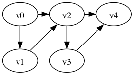
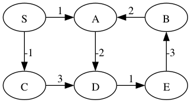
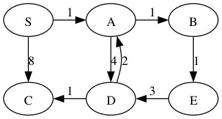
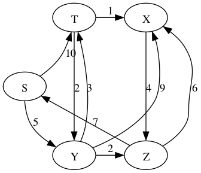

# Shortest Paths

We have seen the shortest path problem where each edge counts as
distance 1 and we used BFS to solve it. Now we consider graphs where
each edge has a real number for its *weight*.

Motivation for the shortest path problem:
- internet packet routing
- driving routes
- minimizing flight duration

Notation: We write w(u,v) or w(e) for the *weight* of an edge.

**Definition** The *weight of a path* is the sum of the weights of its
edges.  We also use the term *distance* for the weight of a path.
  
So for path p = e₁, e₂, ..., eᵣ

    w(p) = Σ{i∈1..r} w(eᵢ)

As with BFS, we'll focus on the single-source shortest-paths problem:
finding the shortest path from a source vertex to every other vertex
in the graph. Other alternatives are:
  
- Single-destination shortest-paths
- Single-pair shortest-path
- All-pairs shortest-paths

## Algorithm Preview

- Bellman-Ford: O(n m)
- Disjktra: 
	* using min-heap: O((n+m) log(n))
	* using Fibonnaci heap: O(n log(n) + m)
- DAG Shortest: O(n+m)      (uses topological sort)

Brute force: compute the length of every path

But this is exponential time: there are O(2ⁿ) paths.
Here's a worst-case scenario.

##  Negative-weight edges

Negative weight edges are not very common in applications.
    
Some shortest-path algorithms handle this (Bellman-ford), some do not
(Dijkstra, DAG Shortest Paths).
      
None of the algorithms handle graphs with negative-weight cycles, as
the notion of shortest-path doesn't make sense on such graphs.
        
Example:
        

The shortest path from S to C is -1.

The shortest path from S to A is undefined because you can keep going
around the cycle A → D → E → B, which has weight -2.
      
We can avoid negative weights in some situations by shifting weights up.

## Dijkstra Shortest Paths

Like BFS, the idea is to expand the wavefront of shortest-paths so far.

The challenge is to figure out how to explore paths in the order of
their weight. Consider the following graph with the source vertex S.

Growing the shortest paths tree in order of path weight:

            W=0   S

            W=1   S-1->A

            W=2   S-1->A-1->B

            W=3   S-1->A-1->B
                            |
                            1
                            |
                            V
                            E

            W=5   S-1->A-1->B
                       |   |
                       4   1
                       |   |
                       V   V
                       D   E

            W=6   S-1->A-1->B
                       |   |
                       4   1
                       |   |
                       V   V
                  C<-1-D   E

Dijkstra's approach to growing the tree is to store all the potential
next vertices (those that are adjacent to the tree) in a priority
queue ordered by the path weight within the current tree plus the
weight of the lightest edge to that vertex. 

Consider The situation above where the shortest paths tree has grown
to include paths of weight 3:

            W=3   S-1->A-1->B
                            |
                            1
                            |
                            V
                            E

Consider all of the out-edges from nodes in the tree to nodes not yet
in the tree.

                  S   A
                 8|   |4
                  V   V
                  C   D<-3-E

So the shortest path so far to these vertices is

    C: 8       (S-8->C)
    D: 5       (S-1->A-4->D)

Then the minimum of the priority queue gives the next shortest path,
in this case, the path to `D`.

            W=5   S-1->A-1->B
                       |   |
                       4   1
                       |   |
                       V   V
                       D   E

In the followinng we grow the shortest-paths tree again, but this time
use the priority queue to keep track of which node to pick for
expanding the tree.

                   SPT                  Priority Queue
            W=0    S                    A:1, C:8

            W=1    S---A                B:2, D:5, C:8

            W=2    S---A---B            E:3, D:5, C:8

            W=3    S---A---B            D:5, C:8
                           |
                           |
                           E

            W=5    S---A---B            C:6  (decrease key!)
                       |   |
                       |   |
                       D   E

            W=6    S---A---B
                       |   |
                       |   |
                   C---D   E

**Student group work**: use Dijkstra's to compute the distances from S
to all the other vertices in the following graph.

        Answers:
    
               S: 0
               T: 8
               X: 9
               Y: 5
               Z: 7

Time Complexity of Dijkstra's Algorithm

 * n pushes to the queue: O(n log(n))
 * n pops from the queue: O(n log(n))
 * m `decrease_key` on the queue: O(m log(n))
 * Total: O((n+m) log(n))

## Shortest paths exhibit *optimal substructure*

That is, a subpath of a shortest path is a shortest path.

More precisely, if you have a shortest path

v₀ →ᵣ vᵢ →p vⱼ →q vk

then the subpath p

vᵢ →p vⱼ

is a shortest path from vᵢ to vⱼ.

Proof. Suppose vᵢ →p vⱼ is not a shortest path from vᵢ to vⱼ.
Then we splice the shortest path p' from vᵢ to vⱼ into
the path v₀ → vk to get

    v₀ →ᵣ vᵢ →p' vⱼ →q vk

which is a shorter path from v₀ to vk.
But that contradicts the assumption that

    v₀ →ᵣ vᵢ →p vⱼ →q vk

was a shortest path.

Take away: the optimal substructure property is why we can grow
shortest paths from smaller shortest paths.

